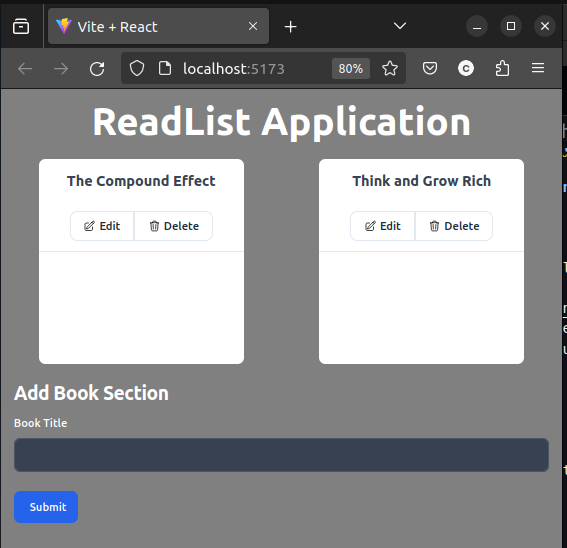
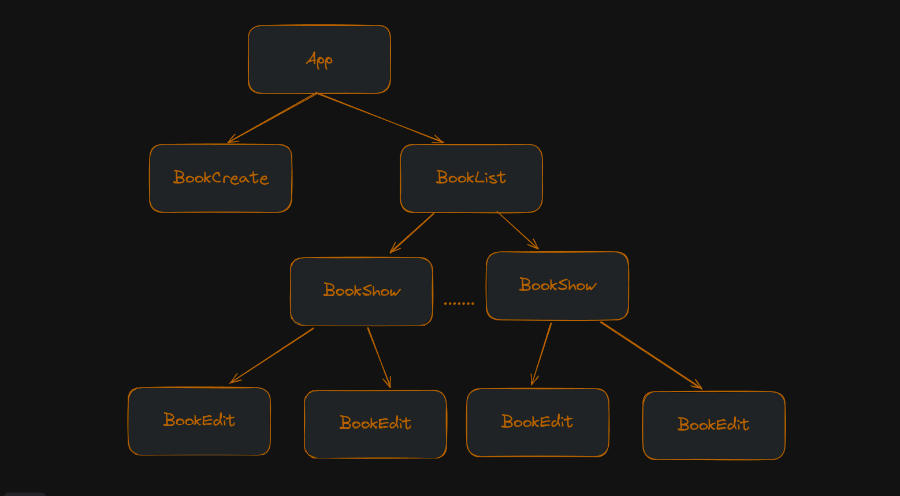

## ReadList Application


We are using `json-server` to simulate a REST API for our application. `json-server` provides a quick and simple way to create a fake RESTful server for development and testing purposes.

To start the json-server, you need to install it first. You can do this globally with the following command:

React App Running
```bash
pnpm install
pnpm run dev
```

Running Server
```bash
pnpm run server
```

## Things Revised and Learned

### useState

Let's Assume my application has following hiearchy.


useState is used whenever we want to take control of the changing thing in our hand. 

Typical Syntax:
```
import { useState } from 'react';

const [variable, setvariable] = useState(someInitialization);

```
We use the first as our variable and to change the state of the variable we can use setVariable method. eg:

```
setVariable(newchangedthing)
```

Since it's a booklist application so, as we can see in the above image the user must be able to:
- Create the Book
- Edit the Book
- Delete the Book
- View the Book List

So we have components related to that, if we figure out carefully we need state in the App Component for saving the list of books. 
- App 
    - App Component is the component where our app starts after the main component. In app component we need to create states so that we can share it easily in between the different components. We are using context to add all the functionalities so that we don't have to pass down props. eg: if the bookedit require some updateBook function defined on the App then the App component should pass it all the way down to the Edit through BookList->BookShow.
    
- BookCreate
    - BookCreate is a component and we need to use state management so that we can pass the latest updated book title we want to add while the user clicks on the submit button. To acheive this we are going to call the updateBook function which is defined on the App component.

- BookEdit
    - The `BookEdit` component is responsible for editing the title of an existing book. It needs to manage the state of the input field that the user interacts with to change the book's title. When the user submits the form, `BookEdit` should call the `updateBook` function from the context, passing the ID of the book and the new title. This function is defined in the `App` component and shared through context, so `BookEdit` doesn't need to receive it as a prop.

- BookShow
    - The `BookShow` component is responsible for displaying the title of a book and providing options to edit or delete the book. It doesn't need to manage any state itself, but it does need to call the `deleteBook` and `updateBook` functions when the user clicks the corresponding buttons. These functions are defined in the `App` component and shared through context, so `BookShow` doesn't need to receive them as props. When the user clicks the 'Edit' button, `BookShow` should render the `BookEdit` component and pass the current book as a prop.